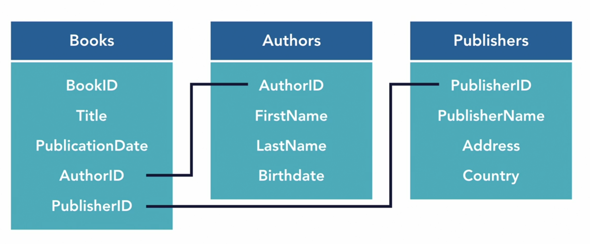
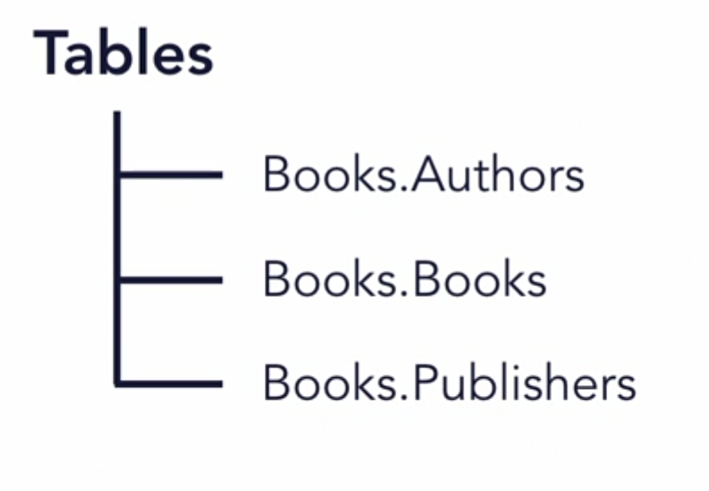

# Notes from Database Foundations 1 Intro to Databases

# Index

- [Notes from Database Foundations 1 Intro to Databases](#notes-from-database-foundations-1-intro-to-databases)
- [Index](#index)
  - [Create a SQL Server container for KinetEco](#create-a-sql-server-container-for-kineteco)
  - [Create a PostgreSQL container for KinetEco](#create-a-postgresql-container-for-kineteco)
  - [Connect in Azure Data Studio to the SQL Server container](#connect-in-azure-data-studio-to-the-sql-server-container)
  - [Connect in Azure Data Studio to the SQL Server container](#connect-in-azure-data-studio-to-the-sql-server-container-1)
  - [Docker Commands](#docker-commands)
    - [View all running containers](#view-all-running-containers)
    - [View all containers regardless of status](#view-all-containers-regardless-of-status)
    - [Stop `sqlserver2019` container](#stop-sqlserver2019-container)
    - [Start `sqlserver2019` container](#start-sqlserver2019-container)
    - [Remove `sqlserver2019` container](#remove-sqlserver2019-container)
    - [Log into `sqlserver2019` docker container](#log-into-sqlserver2019-docker-container)
  - [SQL](#sql)
    - [Create `KinetEco` database](#create-kineteco-database)
    - [Create `Products` table](#create-products-table)
    - [Create, Alter and Drop `Categories` table](#create-alter-and-drop-categories-table)

# Docker y Azure Data Studio

## Crear un contenedor SQL Server para KinetEco

```sh
❯ docker run --name kineteco -e "ACCEPT_EULA=Y" -e "SA_PASSWORD=whatever" -p 1411:1433 -d mcr.microsoft.com/mssql/server:2019-latest
```

## Crear un contenedor PostgreSQL para KinetEco

```sh
❯ docker run --name kineteco -p 5411:5432 -e POSTGRES_PASSWORD=whatever -d postgres:latest
```

## Datos para conectar Azure Data Studio al contenedor SQL Server

```
Connection type: Microsoft SQL Server
Server name: localhost
User name: SA
Password: whatever
Remember password: checked
Server group: KinetEco
Name: KinetEco
Advanced - Port: 1411
```

## Datos para conectar Azure Data Studio al contenedor PostgreSQL

```
Connection type: PostgreSQL
Server name: localhost
User name: postgres
Password: whatever
Remember password: checked
Server group: KinetEco
Name: KinetEco
Advanced - Port: 5411
```

## Resumen de comandos docker

### Listar los contenedores que se están ejecutando

```sh
❯ docker ps
```

### Listar todos los contenedores del sistema

```sh
❯ docker ps -a
```

### Parar el contenedor `sqlserver2019`

```sh
❯ docker stop sqlserver2019
```

### Iniciar el contenedor `sqlserver2019`

```sh
❯ docker start sqlserver2019
```

### Eliminar el contenedor `sqlserver2019` container

```sh
❯ docker rm sqlserver2019
```

### Ejecutar `bash` dentro del contenedor `sqlserver2019`

```sh
❯ docker exec -it sqlserver2019 bash
```

# (20) Creación de una base de datos

## `CREATE DATABASE`

```sql
CREATE DATABASE KinetEco;
```

# (21) SQL

## DDL - Data Definition Language

Podemos realizar las siguientes operaciones sobre objetos (componentes que dotan de estructura) de la BD:

- `CREATE`
- `ALTER`
- `DROP`

Ejemplos de objetos de la BD:

- `TABLE`
- `INDEX`
- `USER`

## DML - Data Manipulation Language

Podemos realizar las siguientes operaciones sobre las tuplas de datos de una BD:

- `INSERT`
- `UPDATE`
- `DELETE`

# (22) Estructura y organización

## Diseño: ejemplo BD para una biblioteca



## `SCHEMA`s

Estructuras que ayudan con la organización de una BD al permitir  agrupar objetos con un criterio de similitud.

## Diseño: ejemplo BD para una biblioteca


## `TABLE` y `SCHEMA`

El nombre del `SCHEMA` pasa a formar parte del nombre de la tabla 👇



## `CREATE SCHEMA`

Creamos `SCHEMA`s usando `CREATE`.

```sql
CREATE SCHEMA books;
CREATE SCHEMA products;
CREATE SCHEMA sales;
```

## `DROP SCHEMA`

Eliminamos `SCHEMA`s usando `DROP`.

```sql
DROP SCHEMA books;
DROP SCHEMA products;
DROP SCHEMA sales;
```

# (23) Tablas

## `CREATE`

El primer `books` es el `SCHEMA`, el segundo `books` es la `TABLE` propiamente dicha. Por lo tanto `<esquema>.<tabla>`.

```sql
CREATE TABLE books.books (
    BookID           INT        NOT NULL   PRIMARY KEY,
    Title            CHAR(50)   NOT NULL,
    PublicationDate  DATE,
    AuthorID         INT        NOT NULL,
    PublisherID      INT        NOT NULL
);
```

# (24) Creación de tablas

## `CREATE`, de nuevo

```sql
CREATE TABLE products.products (
    SKU         CHAR(7)        NOT NULL   PRIMARY KEY,
    ProductName CHAR(50)       NOT NULL,
    CategoryID  INT,
    Size        INT,
    Price       DECIMAL(5,2)   NOT NULL
);
```

# (25) Modificación de tablas

## Creación de la tabla `categories`

```sql
CREATE TABLE products.categories (
    CategoryID          INT        NOT NULL   PRIMARY KEY,
    CategoryDescription CHAR(50)
);
```

## Introducción gráfica de datos en Azure Data Studio


## Modificación de la tabla `categories`

```sql
ALTER TABLE products.categories
ADD ProductLine CHAR(25);
```

## Consecuencias de la modificación


## Corrigiendo el problema


## Borrado de la tabla `categories`

```sql
DROP TABLE products.categories;
```
