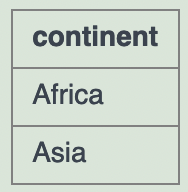
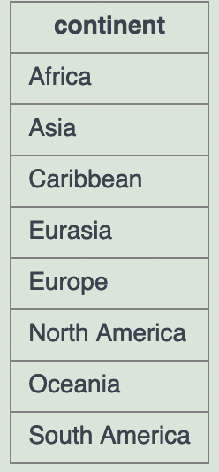

# Máis `GROUP BY` e `HAVING`

## Exercicio

Listar todos os continentes que teñan unha poboación de 1000 millóns ou máis.

## Solución

```sql
SELECT continent
FROM world
GROUP BY continent
HAVING SUM(population) >= 1000000000;
```

## Resultado



## Explicación

`HAVING` **filtra subtáboas**. Só 2 subtáboas (ou continentes) cumplen o predicado do `HAVING` (ter 1000 millóns de habitantes ou máis):

1. `FROM`: Colle a táboa `world`.
2. `GROUP BY`: Fai tantas subtáboas como continentes haxa (8 en SQLZoo).
3. `HAVING`: Elimina aquelas subtáboas que non teñen 1000 ou máis millons de habitantes (elimina 6, queda con 2).
4. `SELECT`: Queda coa columna (ou atributo) `continent`.

## Ollo

O `HAVING` elimina subtáboas do resultado final, xa que:

```sql
SELECT continent
FROM world
GROUP BY continent;
```

saca 8 tuplas



mentres que

```sql
SELECT continent
FROM world
GROUP BY continent
HAVING SUM(population) >= 1000000000;
```

saca 2 tuplas


# Comprobando combinacións de `SELECT` con `GROUP BY`

Comprobade as seguintes consultas no [SQLZoo](https://sqlzoo.net/wiki/SUM_and_COUNT)

## Consulta 1 - Correcta

```sql
SELECT continent
FROM world
GROUP BY continent;
```

## Consulta 2 - Incorrecta

```sql
SELECT continent, area
FROM world
GROUP BY continent;
```

> **ERROR**:

> Column `world.area` is invalid in the `SELECT` list because it is not contained in either an aggregate function or the `GROUP BY` clause.
