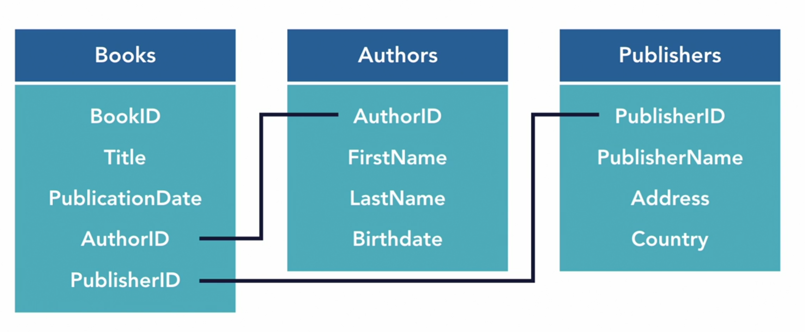
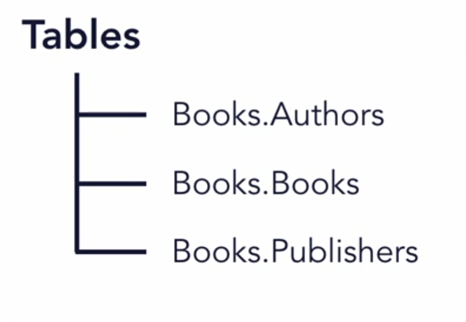

# Notas de Database Foundations 1 Intro to Databases

# Índice

- [Docker y Azure Data Studio](#docker-y-azure-data-studio)
  - [Crear un contenedor SQL Server para KinetEco](#crear-un-contenedor-sql-server-para-kineteco)
  - [Crear un contenedor PostgreSQL para KinetEco](#crear-un-contenedor-postgresql-para-kineteco)
  - [Datos para conectar Azure Data Studio al contenedor SQL Server](#datos-para-conectar-azure-data-studio-al-contenedor-sql-server)
  - [Datos para conectar Azure Data Studio al contenedor PostgreSQL](#datos-para-conectar-azure-data-studio-al-contenedor-postgresql)
  - [Resumen de comandos docker](#resumen-de-comandos-docker)
    - [Listar los contenedores que se están ejecutando](#listar-los-contenedores-que-se-están-ejecutando)
    - [Listar todos los contenedores del sistema](#listar-todos-los-contenedores-del-sistema)
    - [Parar el contenedor `sqlserver2019`](#parar-el-contenedor-sqlserver2019)
    - [Iniciar el contenedor `sqlserver2019`](#iniciar-el-contenedor-sqlserver2019)
    - [Eliminar el contenedor `sqlserver2019` container](#eliminar-el-contenedor-sqlserver2019-container)
    - [Ejecutar `bash` dentro del contenedor `sqlserver2019`](#ejecutar-bash-dentro-del-contenedor-sqlserver2019)
- [(20) Creación de una base de datos](#20-creación-de-una-base-de-datos)
  - [`CREATE DATABASE`](#create-database)
- [(21) SQL](#21-sql)
  - [DDL - Data Definition Language](#ddl---data-definition-language)
  - [DML - Data Manipulation Language](#dml---data-manipulation-language)
- [(22) Estructura y organización](#22-estructura-y-organización)
  - [Diseño: ejemplo BD para una biblioteca](#diseño-ejemplo-bd-para-una-biblioteca)
  - [`SCHEMA`s](#schemas)
  - [Diseño: ejemplo BD para una biblioteca](#diseño-ejemplo-bd-para-una-biblioteca-1)
  - [`TABLE` y `SCHEMA`](#table-y-schema)
  - [`CREATE SCHEMA`](#create-schema)
  - [`DROP SCHEMA`](#drop-schema)
- [(23) Tablas](#23-tablas)
  - [`CREATE`](#create)
- [(24) Creación de tablas](#24-creación-de-tablas)
  - [`CREATE`, de nuevo](#create-de-nuevo)
- [(25) Modificación de tablas](#25-modificación-de-tablas)
  - [Creación de la tabla `categories`](#creación-de-la-tabla-categories)
  - [Introducción gráfica de datos en Azure Data Studio](#introducción-gráfica-de-datos-en-azure-data-studio)
  - [Modificación de la tabla `categories`](#modificación-de-la-tabla-categories)
  - [Consecuencias de la modificación](#consecuencias-de-la-modificación)
  - [Corrigiendo el problema](#corrigiendo-el-problema)
  - [Borrado de la tabla `categories`](#borrado-de-la-tabla-categories)
- [(29) Tuplas](#29-tuplas)
  - [Entidad o tupla](#entidad-o-tupla)
  - [Orden](#orden)
  - [Clave primaria (_primary key o PK_)](#clave-primaria-primary-key-o-pk)
- [(30) `INSERT INTO`](#30-insert-into)
  - [Inserta tuplas](#inserta-tuplas)
  - [Insertar 1 sola tupla](#insertar-1-sola-tupla)
  - [Insertar múltiples tuplas](#insertar-múltiples-tuplas)
  - [Insertar tuplas seleccionando las columnas](#insertar-tuplas-seleccionando-las-columnas)
- [(31a) `UPDATE ... SET ... WHERE`](#31a-update--set--where)
  - [GOTCHA! 👀](#gotcha-)
- [(31b) `DELETE FROM ... WHERE`](#31b-delete-from--where)
  - [👀 MEGA-GOTCHA!!!! 👀](#-mega-gotcha-)
- [(32) A _Script_ of Two Cities](#32-a-script-of-two-cities)
  - [City 1: SQL Server](#city-1-sql-server)
  - [City 2: PostgreSQL](#city-2-postgresql)

# Docker y Azure Data Studio

## Crear un contenedor SQL Server para KinetEco

```sh
❯ docker run --name kineteco -e "ACCEPT_EULA=Y" -e "SA_PASSWORD=whatever" -p 1411:1433 -d mcr.microsoft.com/mssql/server:2019-latest
```

## Crear un contenedor PostgreSQL para KinetEco

```sh
❯ docker run --name kineteco -p 5411:5432 -e POSTGRES_PASSWORD=whatever -d postgres:latest
```

## Datos para conectar Azure Data Studio al contenedor SQL Server

```
Connection type: Microsoft SQL Server
Server name: localhost
User name: SA
Password: whatever
Remember password: checked
Server group: KinetEco
Name: KinetEco
Advanced - Port: 1411
```

## Datos para conectar Azure Data Studio al contenedor PostgreSQL

```
Connection type: PostgreSQL
Server name: localhost
User name: postgres
Password: whatever
Remember password: checked
Server group: KinetEco
Name: KinetEco
Advanced - Port: 5411
```

## Resumen de comandos docker

### Listar los contenedores que se están ejecutando

```sh
❯ docker ps
```

### Listar todos los contenedores del sistema

```sh
❯ docker ps -a
```

### Parar el contenedor `sqlserver2019`

```sh
❯ docker stop sqlserver2019
```

### Iniciar el contenedor `sqlserver2019`

```sh
❯ docker start sqlserver2019
```

### Eliminar el contenedor `sqlserver2019` container

```sh
❯ docker rm sqlserver2019
```

### Ejecutar `bash` dentro del contenedor `sqlserver2019`

```sh
❯ docker exec -it sqlserver2019 bash
```

# (20) Creación de una base de datos

## `CREATE DATABASE`

```sql
CREATE DATABASE KinetEco;
```

# (21) SQL

## DDL - Data Definition Language

Podemos realizar las siguientes operaciones sobre objetos (componentes que dotan de estructura) de la BD:

- `CREATE`
- `ALTER`
- `DROP`

Ejemplos de objetos de la BD:

- `TABLE`
- `INDEX`
- `USER`

## DML - Data Manipulation Language

Podemos realizar las siguientes operaciones sobre las tuplas de datos de una BD:

- `INSERT`
- `UPDATE`
- `DELETE`

# (22) Estructura y organización

## Diseño: ejemplo BD para una biblioteca



## `SCHEMA`s

Estructuras que ayudan con la organización de una BD al permitir  agrupar objetos con un criterio de similitud.

## Diseño: ejemplo BD para una biblioteca


## `TABLE` y `SCHEMA`

El nombre del `SCHEMA` pasa a formar parte del nombre de la tabla 👇



## `CREATE SCHEMA`

Creamos `SCHEMA`s usando `CREATE`.

```sql
CREATE SCHEMA books;
CREATE SCHEMA products;
CREATE SCHEMA sales;
```

## `DROP SCHEMA`

Eliminamos `SCHEMA`s usando `DROP`.

```sql
DROP SCHEMA books;
DROP SCHEMA products;
DROP SCHEMA sales;
```

# (23) Tablas

## `CREATE`

El primer `books` es el `SCHEMA`, el segundo `books` es la `TABLE` propiamente dicha. Por lo tanto `<esquema>.<tabla>`.

```sql
CREATE TABLE books.books (
    BookID           INT        NOT NULL   PRIMARY KEY,
    Title            CHAR(50)   NOT NULL,
    PublicationDate  DATE,
    AuthorID         INT        NOT NULL,
    PublisherID      INT        NOT NULL
);
```

# (24) Creación de tablas

## `CREATE`, de nuevo

```sql
CREATE TABLE products.products (
    SKU         CHAR(7)        NOT NULL   PRIMARY KEY,
    ProductName CHAR(50)       NOT NULL,
    CategoryID  INT,
    Size        INT,
    Price       DECIMAL(5,2)   NOT NULL
);
```

# (25) Modificación de tablas

## Creación de la tabla `categories`

```sql
CREATE TABLE products.categories (
    CategoryID          INT        NOT NULL   PRIMARY KEY,
    CategoryDescription CHAR(50)
);
```

## Introducción gráfica de datos en Azure Data Studio


## Modificación de la tabla `categories`

```sql
ALTER TABLE products.categories
ADD ProductLine CHAR(25);
```

## Consecuencias de la modificación


## Corrigiendo el problema


## Borrado de la tabla `categories`

```sql
DROP TABLE products.categories;
```

# (29) Tuplas

## Entidad o tupla

Una entidad (_entity_) coincide con una tupla o fila: una carta determinada, una mascota determinada, un producto determinado, ...

## Orden

**NO** existe un orden de tuplas predeterminado.

## Clave primaria (_primary key o PK_)

Nos permite identificar una tupla determinada en una tabla.

# (30) `INSERT INTO`

## Inserta tuplas

Nos permite añadir **registros, tuplas, entidades o filas** (las 4 acepciones son equivalentes e intercambiables) a una tabla.

## Insertar 1 sola tupla

```sql
INSERT INTO products.products
VALUES
    ('FCP008', 'First Cold Press', 1, 8, 8.99);
```

## Insertar múltiples tuplas

```sql
INSERT INTO products.products
VALUES
    ('BI008', 'Basil-Infused EVO',  2,  8, 10.99),
    ('GI016', 'Garlic-Infused EVO', 2, 16, 15.99);
```

## Insertar tuplas seleccionando las columnas

- Insertamos `SKU`, `ProductName` y  `Price`.
- **NO** insertamos `CategoryID` ni `Size` (**se ponen a `NULL`**).

👇👇👇

```sql
INSERT INTO products.products
    (SKU, ProductName, Price)
VALUES
    ('OGEC004', 'Olive Glow Eye Cream', 18.99);
```

# (31a) `UPDATE ... SET ... WHERE`

```sql
UPDATE products.products
SET
    CategoryID = 3,
    Size       = 4
WHERE SKU = 'OGEC004';
```

## GOTCHA! 👀


Si no especificamos la cláusula `WHERE` **ACTUALIZA TODAS LAS TUPLAS**.

# (31b) `DELETE FROM ... WHERE`

```sql
DELETE FROM products.products
WHERE SKU = 'OGEC004';
```

## 👀 MEGA-GOTCHA!!!! 👀


Si no especificamos la cláusula `WHERE` **BORRA TODAS LAS TUPLAS**, se crea un agujero negro en nuestra carrera y lo más importante, **un gatito muere**. Se rumorea que existe un **INFIERNO especial** para todas aquellas que usan **`DELETE FROM` sin `WHERE`**.

# (32) A _Script_ of Two Cities

## City 1: SQL Server

```sql
-- Eliminar cualquier objeto preexistente de la base de datos.
-- La base de datos Two Trees quedaría vacía
DROP TABLE  IF EXISTS products.products;
DROP TABLE  IF EXISTS products.categories;
DROP SCHEMA IF EXISTS products;

-- Crear el esquema `products`
GO                        -- NECESARIO EN SQL SERVER
CREATE SCHEMA products;
GO                        -- NECESARIO EN SQL SERVER

-- Crear la tabla `products`
CREATE TABLE products.products (
    SKU         CHAR(7)        NOT NULL   PRIMARY KEY,
    ProductName CHAR(50)       NOT NULL,
    CategoryID  INT,
    Size        INT,
    Price       DECIMAL(5,2)   NOT NULL
);

-- Crear la tabla `categories`
CREATE TABLE products.categories (
    CategoryID          INT        PRIMARY KEY,
    CategoryDescription CHAR(50),
    ProductLine         CHAR(25)
);

-- Añadir datos a la tabla `products`
INSERT INTO products.products
    (SKU, ProductName, CategoryID, Size, Price)
VALUES
    ('FCP008',  'First Cold Press',     1,  8,  8.99),
    ('BI008',   'Basil-Infused EVO',    2,  8, 10.99),
    ('GI016',   'Garlic-Infused EVO',   2, 16, 15.99),
    ('OGEC004', 'Olive Glow Eye Cream', 3,  4, 18.99);

-- Añadir datos a la tabla `categories`
INSERT INTO products.categories
    (CategoryID, CategoryDescription, ProductLine)
VALUES
    (1, 'Olive Oils',          'Gourmet Chef'),
    (2, 'Flavor Infused Oils', 'Gourmet Chef'),
    (3, 'Bath and Beauty',      'Cosmetics');

-- Comprobar que los datos han sido almacenados
SELECT * FROM products.products;
SELECT * FROM products.categories;
```

## City 2: PostgreSQL

```sql
-- Eliminar cualquier objeto preexistente de la base de datos.
-- La base de datos Two Trees quedaría vacía
DROP TABLE  IF EXISTS products.products;
DROP TABLE  IF EXISTS products.categories;
DROP SCHEMA IF EXISTS products;

-- Crear el esquema `products`
CREATE SCHEMA products;

-- Crear la tabla `products`
CREATE TABLE products.products (
    SKU         CHAR(7)        NOT NULL   PRIMARY KEY,
    ProductName CHAR(50)       NOT NULL,
    CategoryID  INT,
    Size        INT,
    Price       DECIMAL(5,2)   NOT NULL
);

-- Crear la tabla `categories`
CREATE TABLE products.categories (
    CategoryID          INT        PRIMARY KEY,
    CategoryDescription CHAR(50),
    ProductLine         CHAR(25)
);

-- Añadir datos a la tabla `products`
INSERT INTO products.products
    (SKU, ProductName, CategoryID, Size, Price)
VALUES
    ('FCP008',  'First Cold Press',     1,  8,  8.99),
    ('BI008',   'Basil-Infused EVO',    2,  8, 10.99),
    ('GI016',   'Garlic-Infused EVO',   2, 16, 15.99),
    ('OGEC004', 'Olive Glow Eye Cream', 3,  4, 18.99);

-- Añadir datos a la tabla `categories`
INSERT INTO products.categories
    (CategoryID, CategoryDescription, ProductLine)
VALUES
    (1, 'Olive Oils',          'Gourmet Chef'),
    (2, 'Flavor Infused Oils', 'Gourmet Chef'),
    (3, 'Bath and Beauty',      'Cosmetics');

-- Comprobar que los datos han sido almacenados
SELECT * FROM products.products;
SELECT * FROM products.categories;
```
